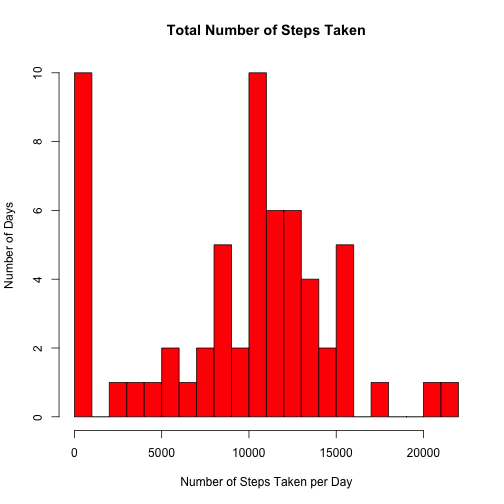
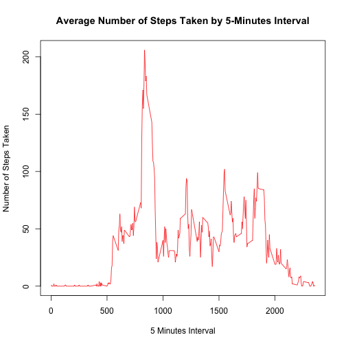
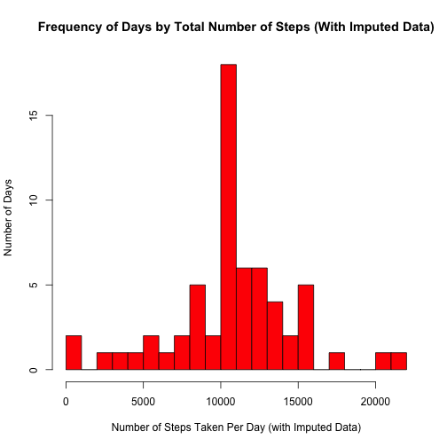
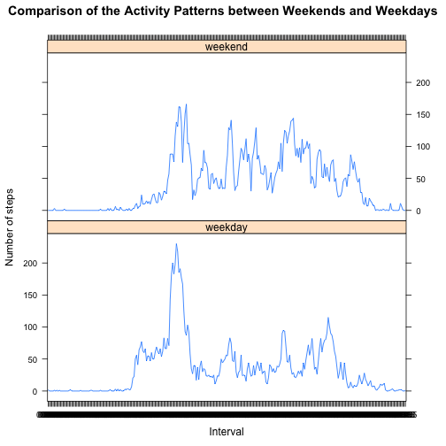

#### Coursera-Reproducible Research: Assignment 1  
#### Submitted by: Onook Oh 
#### Last created: Sun May 18 19:34:00 2014

+++++++++++++++++++++++++++++++++++++++++++++++++++++++++++++++++++++++++++


```r
# Global setting of 'echo=TRUE' so that readers can always read the code.
```


### Loading and preprocessing the data
#### (1) Load teh data (i.e., read.csv())

```r
data <- read.csv(unz("activity.zip", "activity.csv"), header = TRUE, sep = ",", 
    stringsAsFactors = FALSE)
```

#### (2) Process/transform the data (if necessary) into a format suitable for your analysis

```r
str(data)
```

```
## 'data.frame':	17568 obs. of  3 variables:
##  $ steps   : int  NA NA NA NA NA NA NA NA NA NA ...
##  $ date    : chr  "2012-10-01" "2012-10-01" "2012-10-01" "2012-10-01" ...
##  $ interval: int  0 5 10 15 20 25 30 35 40 45 ...
```

```r
# 1. Convert the date variable from 'char' to 'date' data type
data$date <- as.Date(data$date)

# 2. Convert the 'interval' variable into 5-characters strings having
# paading at the left '0':
data$interval <- as.character(formatC(data$interval, width = 5, flag = "0"))

# 3. Split the data by 'interval' Identifier:
data.steps_by_interval <- split(data$steps, data$interval)

# 4. Calculate the average steps by each 'interval' identifier across all
# days:
data.avg_steps_by_interval <- as.integer(lapply(data.steps_by_interval, mean, 
    na.rm = TRUE))

# 5. Save the average steps for each 'interval' identifier:
data <- data.frame(data, data.avg_steps_by_interval)
colnames(data)[ncol(data)] <- "avg_steps_per_interval"

# 6. Find and save the weekday number for each date:
data.dates_as_numbers <- strftime(as.Date(data$date), format = "%u")
data.dates_are_weekend <- data.dates_as_numbers == "6" | data.dates_as_numbers == 
    "7"

# 7. Create and save factor variables for weekday and weekend
data.dates_are_weekend <- factor(data.dates_are_weekend)
levels(data.dates_are_weekend) <- c("weekday", "weekend")
data <- data.frame(data, data.dates_are_weekend)
colnames(data)[ncol(data)] <- "day_type"

# 8. Create and save the summary by date:
data.summary_by_date <- as.data.frame(unique(data$date))
colnames(data.summary_by_date)[ncol(data.summary_by_date)] <- "date"

# 9. Split the data by 'date':
data.steps_by_date <- split(data$steps, data$date)

# 10.Calculate the average steps by each 'date', across all intervals, and
# store them in the auxiliary data frame:
data.summary_by_date <- data.frame(data.summary_by_date, as.integer(lapply(data.steps_by_date, 
    sum, na.rm = TRUE)))
colnames(data.summary_by_date)[ncol(data.summary_by_date)] <- "total_steps"

str(data)
```

```
## 'data.frame':	17568 obs. of  5 variables:
##  $ steps                 : int  NA NA NA NA NA NA NA NA NA NA ...
##  $ date                  : Date, format: "2012-10-01" "2012-10-01" ...
##  $ interval              : chr  "00000" "00005" "00010" "00015" ...
##  $ avg_steps_per_interval: int  1 0 0 0 0 2 0 0 0 1 ...
##  $ day_type              : Factor w/ 2 levels "weekday","weekend": 1 1 1 1 1 1 1 1 1 1 ...
```

```r
head(data)
```

```
##   steps       date interval avg_steps_per_interval day_type
## 1    NA 2012-10-01    00000                      1  weekday
## 2    NA 2012-10-01    00005                      0  weekday
## 3    NA 2012-10-01    00010                      0  weekday
## 4    NA 2012-10-01    00015                      0  weekday
## 5    NA 2012-10-01    00020                      0  weekday
## 6    NA 2012-10-01    00025                      2  weekday
```


### What is mean total number of steps taken per day?
#### For this part of the assignment, you can ignore the missing values in the dataset.
#### (1) Make a histogram of the toal number of steps taken each day.

```r
hist(data.summary_by_date$total_steps, breaks = 20, col = "red", main = "Total Number of Steps Taken", 
    xlab = "Number of Steps Taken per Day", ylab = "Number of Days")
```

 


### (2) Calculate and report the mean and median tatal number of steps taken per day

```r
mean(data.summary_by_date$total_steps)
```

```
## [1] 9354
```

```r
median(data.summary_by_date$total_steps)
```

```
## [1] 10395
```


### What is the average daily activity pattern?
#### (1) make a time series plot (i.e., type="l") of the 5 minute interval (x-axis) and the average number of steps taken averaged across all days (y-axis)

```r
plot(unique(data$interval), data.avg_steps_by_interval, type = "l", col = "red", 
    main = "Average Number of Steps Taken by 5-Minutes Interval", xlab = "5 Minutes Interval", 
    ylab = "Number of Steps Taken")
```

 


#### (2) Which 5-minutes, on average across all the days in the dataset, contains the manixum number of steps?

```r
# The 104th 5minutes interval contains the maximum number of steps.
# max(data.avg_steps_by_interval)
which.max(data.avg_steps_by_interval)
```

```
## [1] 104
```

```r

# The 2nd 5minutes interval contains the maximum number of steps.
# min(data.avg_steps_by_interval)
which.min(data.avg_steps_by_interval)
```

```
## [1] 2
```

```r

unique(data$interval)[which.max(data.avg_steps_by_interval)]
```

```
## [1] "00835"
```

```r

max.interval.name <- as.character(unique(data$interval)[which.max(data.avg_steps_by_interval)])
max.interval.hour <- substr(max.interval.name, 1, 2)
max.interval.minutes <- substr(max.interval.name, 3, 4)
cat("The interval with the average maximum number of steps (", max(data.avg_steps_by_interval), 
    " steps) occurred at ", max.interval.hour, " hours and ", max.interval.minutes, 
    " minutes")
```

```
## The interval with the average maximum number of steps ( 206  steps) occurred at  00  hours and  83  minutes
```


### Imputing missing values.
#### (1) Calcuate and report the total number of missing values in the dataset (i.e., the total number of rows with NAs)

```r
sum(is.na(data$steps))
```

```
## [1] 2304
```

```r
table(is.na(data$steps))
```

```
## 
## FALSE  TRUE 
## 15264  2304
```


#### (2) Deivse a strategy for filling in all of the missing values in the dataset. The strategy does not need to be sophiscticated. For example, you could use the mean/median for that day, or the deam for that 5-minute interval etc. 
**Response**: In this homework, I will impute the missing data with 5-minute interval.

#### (3) Create a new dataset that is equal to the original dataset but with the missing value filled in.

```r
# Impute missing values using the average steps taken at 5 minute interval
# which was pre-calculated during the data pre-processing.
data <- data.frame(data, data$steps)
colnames(data)[ncol(data)] <- "steps_imputed"

data$steps_imputed[is.na(data$steps)] <- data$avg_steps_per_interval
```

```
## Warning: number of items to replace is not a multiple of replacement
## length
```

```r
head(data)
```

```
##   steps       date interval avg_steps_per_interval day_type steps_imputed
## 1    NA 2012-10-01    00000                      1  weekday             1
## 2    NA 2012-10-01    00005                      0  weekday             0
## 3    NA 2012-10-01    00010                      0  weekday             0
## 4    NA 2012-10-01    00015                      0  weekday             0
## 5    NA 2012-10-01    00020                      0  weekday             0
## 6    NA 2012-10-01    00025                      2  weekday             2
```


#### (4) Make a histogram of the total number of steps taken each day and calculate and report the mean and median total number of steps taken per day. Do these values differ from the estimates from the first part of the assignment? What is the impact of imputing missing data on the estimates of the total daily number of steps?


```r
# Calculate the new averages by 'date' (across all intervals):
data.steps_daily_avg <- split(data$steps_imputed, data$date)
data.summary_by_date <- data.frame(data.summary_by_date, as.integer(lapply(data.steps_daily_avg, 
    sum, na.rm = TRUE)))
colnames(data.summary_by_date)[ncol(data.summary_by_date)] <- "total_steps_imputed"

# Make the histogram
hist(data.summary_by_date$total_steps_imputed, breaks = 20, col = "red", main = "Frequency of Days by Total Number of Steps (With Imputed Data)", 
    xlab = "Number of Steps Taken Per Day (with Imputed Data)", ylab = "Number of Days")
```

 

```r

# Mean and Media for total steps taken by day (using the imputed data)
mean(data.summary_by_date$total_steps_imputed)
```

```
## [1] 10750
```

```r
median(data.summary_by_date$total_steps_imputed)
```

```
## [1] 10641
```


**The comparison of total steps taken between the original data having missing values and the imputed data:**

**Mean steps** taken with **the original data** containing missing data: **9354**  
**Mean steps** taken with **the imputed data**: **10750**  
**Median steps** taken with **the original data** containing missing data: **10395**   
**Median steps** taken with **the imputed data**: **10641**  


**Impact of imputing the missing data with average number of steps taken per 5 minute interval:** Compared to the histogram drawn from data having missing values, the histogrm drawn from the imputed data seems to be more normal, because it imputed the missing values (i.e., steps taken per day='NA') with average number of steps taken per day.


### Are there differences in activity patterns between weekdays and weekends? For this part the weekdays() function may be of some help here. Use the dataset with the filled-in missing values for this part.

#### (1) Create a new factor variable in the dataset with two levels – “weekday” and “weekend” indicating whether a given date is a weekday or weekend day.

**Response:** See above section on "Process/transform the data (if necessary) into a format suitable for your analysis". Especially, refer to the sub-section titled 'Create and save factor variables for weekday and weekend'. Now, we extract the average number of steps for the 5-minutes intervals, averaged across for both weekdays and weekends by using the imputed data.


```r
data.summary_by_interval <- as.data.frame(unique(data$interval))
colnames(data.summary_by_interval)[ncol(data.summary_by_interval)] <- "interval"

# Create a new factor variable in the dataset with two levels of 'weekday'
# and 'weekend'.
data.steps_by_day_type <- split(data$steps_imputed, list(data$interval, data$day_type))

# Calculate the average steps by 'interval' across all weekdays and
# weekends):
data.avg_steps_by_day_type <- as.integer(lapply(data.steps_by_day_type, mean))

# Create data frames for data for weekdays...:
data.summary_by_interval_wd <- data.frame(data.summary_by_interval, data.avg_steps_by_day_type[1:288])
colnames(data.summary_by_interval_wd)[ncol(data.summary_by_interval_wd)] <- "avg_steps"
data.summary_by_interval_wd <- data.frame(data.summary_by_interval_wd, "weekday")
colnames(data.summary_by_interval_wd)[ncol(data.summary_by_interval_wd)] <- "day_type"

# Create data frames for data for weekends
data.summary_by_interval_we <- data.frame(data.summary_by_interval, data.avg_steps_by_day_type[289:576])
colnames(data.summary_by_interval_we)[ncol(data.summary_by_interval_we)] <- "avg_steps"
data.summary_by_interval_we <- data.frame(data.summary_by_interval_we, "weekend")
colnames(data.summary_by_interval_we)[ncol(data.summary_by_interval_we)] <- "day_type"

# Bind two sperate data (of weekends and weekdays) into one data frame:
data.summary_by_interval_wd_we <- rbind(data.summary_by_interval_wd, data.summary_by_interval_we)

head(data.summary_by_interval_wd_we)
```

```
##   interval avg_steps day_type
## 1    00000         2  weekday
## 2    00005         0  weekday
## 3    00010         0  weekday
## 4    00015         0  weekday
## 5    00020         0  weekday
## 6    00025         1  weekday
```

```r
tail(data.summary_by_interval_wd_we)
```

```
##     interval avg_steps day_type
## 571    02330         1  weekend
## 572    02335        11  weekend
## 573    02340         6  weekend
## 574    02345         1  weekend
## 575    02350         0  weekend
## 576    02355         0  weekend
```


#### (2) Make a panel plot containing a time series plot (i.e. type = "l") of the 5-minute interval (x-axis) and the average number of steps taken, averaged across all weekday days or weekend days (y-axis). 


```r
library(lattice)
xyplot(avg_steps ~ interval | day_type, data = data.summary_by_interval_wd_we, 
    type = c("l", "l"), layout = c(1, 2), xlab = "Interval", ylab = "Number of steps", 
    main = "Comparison of the Activity Patterns between Weekends and Weekdays")
```

 

